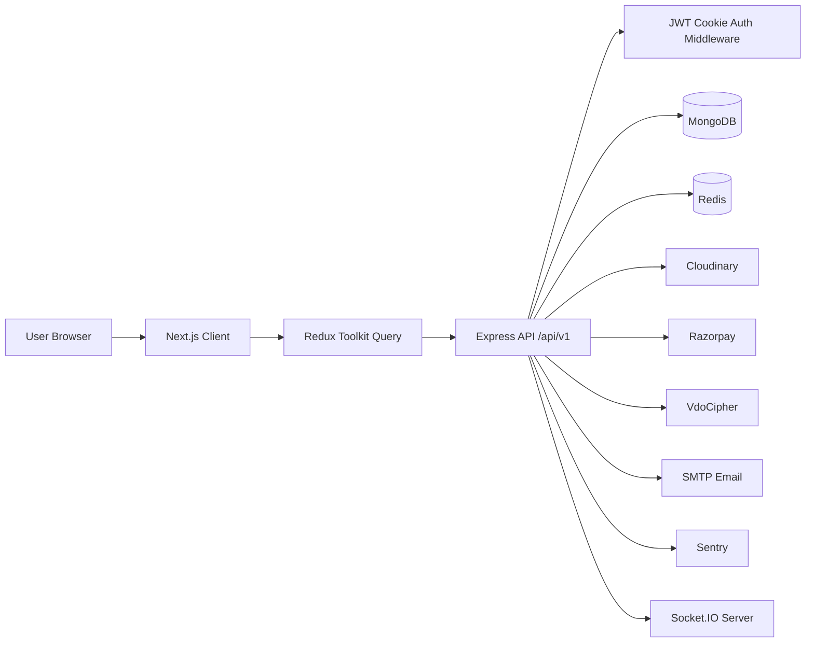

# TechEduCoder Project Architecture and API Test Report

Generated: 2026-08-10  
Workspace: `E:\lms\TechEduCoder-main`  
Test base URL: `http://localhost:8000`

## 1. Project Summary

TechEduCoder is a learning management system with:

- A Next.js client app in `client/`.
- A Node.js/Express TypeScript API in `server/`.
- MongoDB/Mongoose models for users, courses, ebooks, blogs, orders, notifications, layouts, and course events.
- Redis for authenticated user session/cache lookup.
- Cloudinary for uploaded media.
- Razorpay for course/ebook payments.
- VdoCipher for protected video OTP playback.
- Sentry for backend and frontend error monitoring.

The repository now has a root `package.json` build workflow:

```powershell
npm run build
```

This builds `server` first and then `client`.

## 2. High-Level Architecture



## 3. Client Architecture

Main location: `client/`

Important folders:

| Path | Purpose |
| --- | --- |
| `app/` | Next.js App Router pages and UI. |
| `app/admin/` | Admin dashboard pages for courses, users, ebooks, blogs, analytics, layouts, events. |
| `app/components/` | Shared page and feature components. |
| `app/course-access/`, `app/eBook-access/` | Purchased content access views. |
| `pages/api/auth/[...nextauth]` | NextAuth API route. |
| `redux/features/` | RTK Query API slices and Redux slices. |
| `public/` | Static assets. |
| `sentry.*.config.ts` | Sentry setup for client/server/edge runtimes. |

Client data flow:

1. UI components call RTK Query hooks.
2. RTK Query uses `NEXT_PUBLIC_SERVER_URI`.
3. API calls include cookies with `credentials: "include"` where auth is needed.
4. Auth state is stored in Redux after login/load-user.

## 4. Server Architecture

Main location: `server/`

Important folders:

| Path | Purpose |
| --- | --- |
| `server.ts` | Starts HTTP server, configures Cloudinary, initializes Socket.IO, connects MongoDB. |
| `app.ts` | Express app setup, CORS, route mounting, Sentry, error handling. |
| `routes/` | API route definitions. |
| `controllers/` | Request handlers and business workflow. |
| `models/` | Mongoose schemas. |
| `services/` | Shared service helpers for users, courses, orders. |
| `middleware/` | Auth, role checks, async error wrapper, error middleware. |
| `utils/` | DB, Redis, JWT, mail, Cloudinary storage, analytics helpers. |
| `mails/` | EJS email templates. |
| `build/` | Compiled TypeScript output. |
| `scripts/api-smoke-test.ps1` | Repeatable API smoke-test script. |

Backend request flow:

1. Request hits Express.
2. API routes are mounted under `/api/v1`.
3. Protected routes call `isAutheticated`.
4. Admin routes also call `authorizeRoles("admin")`.
5. Controllers read/write MongoDB and call external services as needed.
6. Errors go through Sentry and `ErrorMiddleware`.

## 5. Data Model Overview

| Model | Purpose |
| --- | --- |
| `user.model.ts` | Users, roles, avatar, purchased courses/books. |
| `course.model.ts` | Course metadata, sections, videos, questions, reviews. |
| `ebook.model.ts` | Ebook metadata, PDF, thumbnail, purchase count. |
| `blogs.model.ts` | Blog content and thumbnails. |
| `order.Model.ts` | Course orders. |
| `bookOrder.Model.ts` | Ebook orders. |
| `layout.model.ts` | Banner, FAQ, categories. |
| `notification.Model.ts` | Admin/user notifications. |
| `courseEvents.model.ts` | Course discount/event campaigns. |

## 6. Runtime Dependencies

Required `.env` keys found in `server/.env`:

```text
PORT
ORIGIN
DB_URL
CLOUD_NAME
CLOUD_API_KEY
CLOUD_SECRET_KEY
REDIS_URL
ACTIVATION_SECRET
ACCESS_TOKEN
REFRESH_TOKEN
ACCESS_TOKEN_EXPIRE
REFRESH_TOKEN_EXPIRE
SMTP_HOST
SMTP_PORT
SMTP_SERVICE
SMTP_MAIL
SMTP_PASSWORD
VDOCIPHER_API_SECRET
KEY_ID
KEY_SECRET
API_KEY
```

Do not commit real secrets. Sentry DSN is currently hardcoded in `server/app.ts`; it should be moved to env.

## 7. API Inventory

All backend routes are mounted under `/api/v1`, except root health `/`.

### User/Auth

| Method | Path | Access |
| --- | --- | --- |
| POST | `/registration` | Public |
| POST | `/activate-user` | Public |
| POST | `/login` | Public |
| GET | `/logout` | Auth |
| GET | `/me` | Auth |
| POST | `/social-auth` | Public |
| PUT | `/update-user-info` | Auth |
| PUT | `/update-user-password` | Auth |
| PUT | `/update-user-avatar` | Auth |
| GET | `/get-users` | Admin |
| PUT | `/update-user` | Admin |
| DELETE | `/delete-user/:id` | Admin |

### Courses

| Method | Path | Access |
| --- | --- | --- |
| POST | `/create-course` | Admin |
| PUT | `/edit-course/:id` | Admin |
| GET | `/get-course/:id` | Public |
| GET | `/get-courses` | Public |
| GET | `/get-admin-courses` | Admin |
| GET | `/get-course-content/:id` | Auth |
| PUT | `/add-question` | Auth |
| PUT | `/add-answer` | Auth |
| PUT | `/add-review/:id` | Auth |
| PUT | `/add-reply` | Admin |
| POST | `/getVdoCipherOTP` | Public, external service |
| DELETE | `/delete-course/:id` | Admin |

### Orders/Payments

| Method | Path | Access |
| --- | --- | --- |
| POST | `/create-order` | Public in code |
| POST | `/create-BookOrder` | Public in code |
| POST | `/validateBookOrder` | Public |
| POST | `/validate-order` | Public |
| GET | `/get-orders` | Admin |
| GET | `/get-Book-orders` | Admin |

### Notifications and Analytics

| Method | Path | Access |
| --- | --- | --- |
| GET | `/get-all-notifications` | Admin |
| PUT | `/update-notification/:id` | Admin |
| GET | `/get-users-analytics` | Admin |
| GET | `/get-orders-analytics` | Admin |
| GET | `/get-courses-analytics` | Admin |

### Layouts

| Method | Path | Access |
| --- | --- | --- |
| POST | `/create-layout` | Admin |
| PUT | `/edit-layout` | Admin |
| GET | `/get-layout/:type` | Public |

### Blogs

| Method | Path | Access |
| --- | --- | --- |
| POST | `/create-blog` | Admin |
| GET | `/all-blogs` | Public |
| GET | `/blog-details/:id` | Public |
| PUT | `/update-blog/:id` | Public in code |
| DELETE | `/delete-blog/:id` | Admin |
| GET | `/all-admin-blogs` | Admin |

### Ebooks

| Method | Path | Access |
| --- | --- | --- |
| POST | `/create-ebook` | Admin |
| GET | `/all-ebooks` | Public |
| GET | `/ebook-details/:id` | Public |
| PUT | `/edit-ebook/:id` | Admin |
| DELETE | `/delete-Ebook/:id` | Admin |
| GET | `/get-allEbooks` | Admin |

### Course Events

| Method | Path | Access |
| --- | --- | --- |
| POST | `/create-course-event` | Admin |
| GET | `/adminGetCourseEvent` | Admin |
| GET | `/UserGetCourseEvent` | Public |
| DELETE | `/deleteCourseEvent/:id` | Admin |

## 8. API Smoke Test Method

Command used:

```powershell
cd server
.\scripts\api-smoke-test.ps1
```

Test style:

- Public read endpoints were called normally.
- Protected/admin endpoints were called without auth and expected to reject with auth failure.
- Destructive create/update/delete endpoints were only tested at auth gate or invalid-body level.
- VdoCipher OTP was skipped to avoid calling a paid/external API without a real video id.

Result summary:

| Result | Count |
| --- | ---: |
| PASS | 59 |
| SKIP | 1 |
| FAIL | 0 |

## 9. API Smoke Test Results

| Area | Method | Path | Status | Result | Notes |
| --- | --- | --- | ---: | --- | --- |
| Health | GET | `/` | 200 | PASS | API health works. |
| Public | GET | `/api/v1/get-courses` | 200 | PASS | Course list works. |
| Public | GET | `/api/v1/get-course/000000000000000000000000` | 200 | PASS | Returns `course: null`. Consider 404. |
| Public | GET | `/api/v1/all-blogs` | 200 | PASS | Blog list works. |
| Public | GET | `/api/v1/blog-details/000000000000000000000000` | 200 | PASS | Returns `blog: null`. Consider 404. |
| Public | GET | `/api/v1/all-ebooks` | 200 | PASS | Ebook list works. |
| Public | GET | `/api/v1/ebook-details/000000000000000000000000` | 404 | PASS | Missing ebook returns 404. |
| Public | GET | `/api/v1/get-layout/Banner` | 201 | PASS | Works, but GET should usually return 200. Banner data is currently null. |
| Public | GET | `/api/v1/get-layout/FAQ` | 201 | PASS | Works, but GET should usually return 200. |
| Public | GET | `/api/v1/get-layout/Categories` | 201 | PASS | Works, but GET should usually return 200. |
| Public | GET | `/api/v1/UserGetCourseEvent` | 200 | PASS | Public event list works. |
| Auth | POST | `/api/v1/login` | 400 | PASS | Invalid body rejected. |
| Auth | POST | `/api/v1/activate-user` | 400 | PASS | Invalid body rejected. |
| Auth | POST | `/api/v1/social-auth` | 400 | PASS | Invalid body rejected. |
| Auth/Admin/Course | Multiple protected endpoints | 400 | PASS | Auth middleware rejects unauthenticated calls. |
| Payment | POST | `/api/v1/create-order` | 404 | PASS | Invalid body rejected before external order success. |
| Payment | POST | `/api/v1/create-BookOrder` | 404 | PASS | Invalid body rejected before external order success. |
| Payment | POST | `/api/v1/validate-order` | 400 | PASS | Invalid Razorpay signature rejected. |
| Payment | POST | `/api/v1/validateBookOrder` | 400 | PASS | Invalid Razorpay signature rejected. |
| Mismatch | POST | `/api/v1/create-message` | 404 | PASS | Client calls this but backend route is missing. |
| Mismatch | GET | `/api/v1/payment/razorpaykey` | 404 | PASS | Client calls this but backend route is missing. |
| Mismatch | GET | `/api/v1/all-admin-ebooks` | 404 | PASS | Client route does not match backend `/get-allEbooks`. |
| Mismatch | PUT | `/api/v1/updateCourseEvent/:id` | 404 | PASS | Client route exists but backend update route is commented out. |
| External | POST | `/api/v1/getVdoCipherOTP` | SKIP | SKIP | Skipped to avoid external paid API call. |

## 10. Findings and Recommendations

### Critical/Security

1. `PUT /api/v1/update-blog/:id` is public in `server/routes/blogs.route.ts`.
   - It should use `isAutheticated` and `authorizeRoles("admin")`.

2. Rate limiter is mounted after routes in `server/app.ts`.
   - Current placement does not protect the API routes.
   - Move `app.use(limiter)` before `app.use('/api/v1', ...)`.

3. Sentry DSN is hardcoded in `server/app.ts`.
   - Move it to `process.env.SENTRY_DSN`.

4. Payment create routes are public in code and expect `userId` in request body.
   - Safer workflow: require auth, derive user id from `req.user`, and never trust client-provided `userId`.

### Client/Backend Mismatches

1. Contact form calls `POST /create-message`, but server has no `create-message` route.
   - Contact form will fail until a backend route/controller/model exists or the client is changed.

2. Client calls `GET /payment/razorpaykey`, but backend route is missing/commented.
   - Add a route to return the public Razorpay key, or remove the client query.

3. Client admin ebook API calls `/all-admin-ebooks`, but backend route is `/get-allEbooks`.
   - Align route names.

4. Client course event edit API calls `/updateCourseEvent/:id`, but backend update route is commented out.
   - Implement backend update route or remove edit UI flow.

5. Client order create mutation sends `{ amount, currency, courseId }`, but server expects `{ amount, currency, courseId, userId }`.
   - Prefer auth-derived user id on server.

### API Consistency

1. `GET /api/v1/get-layout/:type` returns HTTP 201.
   - Use 200 for successful GET.

2. Course/blog detail routes return 200 with `null` for missing records.
   - Use 404 to match ebook behavior.

3. Route naming/casing is inconsistent:
   - `/create-BookOrder`
   - `/validateBookOrder`
   - `/delete-Ebook/:id`
   - `/get-allEbooks`
   - `/UserGetCourseEvent`
   - Consider lowercase kebab-case for all API paths.

4. Root health response has typo `succcess`.
   - Change to `success`.

## 11. Build Status

Last verified command:

```powershell
npm run build
```

Result:

- Server TypeScript build passed.
- Client Next.js production build passed.
- Client still reports non-blocking ESLint warnings for hook dependencies, `` usage, and CSR deopt warnings on `/events` and `/courses`.

